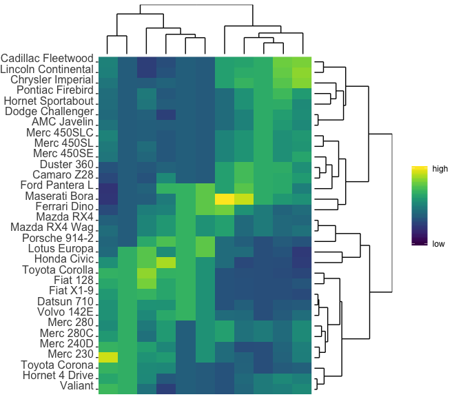

<!-- README.md is generated from README.Rmd. Please edit that file -->
zheatmap
========

This is a package that makes heatmaps with dendrograms. To install the package, use the commands below:

``` r
devtools::install_github("zhuchcn/zheatmap")
```

Basic usage:

``` r
library(zheatmap)
zheatmap(mtcars)
```



Vignette:

[Introduction to zheatmap](https://zhuchcn.github.io/softwares/packages/zheatmap)
